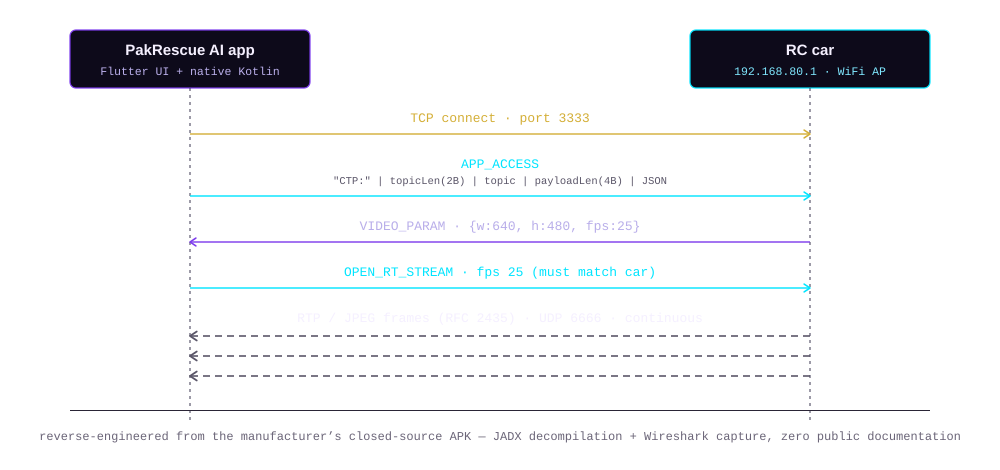

<a href="./README.md">Home</a> &nbsp;&#183;&nbsp; <a href="./ABOUT.md">About</a> &nbsp;&#183;&nbsp; <a href="./EXPERIENCE.md">Experience</a> &nbsp;&#183;&nbsp; <a href="./PROJECTS.md"><b>Projects</b></a> &nbsp;&#183;&nbsp; <a href="./SKILLS.md">Skills</a>

# Projects

## PakRescue AI

*Flagship project*
`Flutter` `Kotlin` `Android` `JADX` `Wireshark` `TCP/UDP` `RTP · RFC 2435`

**An Android app that pilots and monitors a WiFi-connected rescue robot in real time — built without any official protocol documentation.**

**The problem.** The rescue car ships with a closed-source companion APK. No public docs, no API reference — just a working app and a WiFi hotspot.

**The approach.**
- Decompiled the manufacturer's APK with **JADX** to study its networking and media-playback internals
- Captured live traffic in **Wireshark** to map the actual wire protocol against the decompiled source
- Reverse-engineered a custom **TCP control channel** — a length-prefixed JSON framing protocol used for commands like connect, start-stream, and stop-stream
- Rebuilt the **live video pipeline** by hand: an RTP-over-UDP transport carrying RFC 2435 JPEG-over-RTP frames, reassembled fragment-by-fragment using RTP timestamps and marker bits
- Fixed an Android-specific bug where the OS silently drops an "unvalidated" WiFi connection (no internet access) from the routing table after ~47 seconds, by binding sockets directly to the WiFi network interface

**Stack.** Flutter (UI) + native Kotlin (networking, media, platform channels)
**Status.** Final Year Project, in active development
**Source.** Private repository — case study and code available on request

 

## Other builds

**AI-Powered Chatbot**
A conversational AI assistant with chat history and topic management, powered by the Google Gemini API.
`React.js` `Node.js` `Express` `MongoDB` `Gemini API`
[Repository →](https://github.com/KainatJamal/AI-Powered-Chatbot)

**Kainova — e-commerce website**
A shopping platform for apparel and jewelry with product listings, cart, and checkout flow.
`React.js` `Django` `HTML` `CSS`
[Repository →](https://github.com/KainatJamal/Kainova---An-E-commerce-Website)

**Real-time chat app**
Instant messaging with contact management, media sharing, and search — built on Socket.IO and Firebase.
`React.js` `Node.js` `Express` `Socket.IO` `Firebase`
[Repository →](https://github.com/KainatJamal/Real-Time-Chat-App)

**Real-time collaborative editor**
Google-Docs-style multi-user document editor with live sync, text styling, and `.docx` import/export.
`React` `Express.js` `Socket.io` `MongoDB`
[Repository →](https://github.com/KainatJamal/Collaborative-Editor)

**Social media platform**
Post creation, likes, trending hashtags, and JWT-secured auth with profile image uploads.
`React.js` `Node.js` `Express` `MongoDB` `JWT`
[Repository →](https://github.com/KainatJamal/Social-Media-Website)

**User authentication system**
Secure login/signup with email-password and Google auth, backed by JWT and Firebase.
`React` `Node.js` `Express` `PostgreSQL` `Firebase` `JWT`
[Repository →](https://github.com/KainatJamal/Login-Sigup-Form)

**SSUET hostel management system**
A hostel booking platform with student registration, room reservations, and payment options.
`PHP` `MySQL` `Bootstrap` `JavaScript`

 

<a href="./README.md">Home</a> &nbsp;&#183;&nbsp; <a href="./ABOUT.md">About</a> &nbsp;&#183;&nbsp; <a href="./EXPERIENCE.md">Experience</a> &nbsp;&#183;&nbsp; <a href="./PROJECTS.md"><b>Projects</b></a> &nbsp;&#183;&nbsp; <a href="./SKILLS.md">Skills</a>

