<div align="center">



<a href="https://readme-typing-svg.demolab.com">
  
</a>

<sub>Karachi, Pakistan &nbsp;&#183;&nbsp; open to full-time, remote &amp; freelance work</sub>

<br/><br/>

<sub><a href="./README.md"><b>Home</b></a> &nbsp;&#183;&nbsp; <a href="./ABOUT.md">About</a> &nbsp;&#183;&nbsp; <a href="./EXPERIENCE.md">Experience</a> &nbsp;&#183;&nbsp; <a href="./PROJECTS.md">Projects</a> &nbsp;&#183;&nbsp; <a href="./SKILLS.md">Skills</a></sub>


</div>

<br/>

```bash
$ whoami
kainat_jamal — full-stack developer · protocol & systems engineering

$ cat mission.txt
I build software that works exactly as documented —
even when the documentation doesn't exist yet.

$ ls flagship/
PakRescue-AI/   an Android app for a WiFi rescue robot.
                protocol reverse-engineered from zero docs.
```

I'm a Computer Engineering graduate from **Sir Syed University of Engineering & Technology (SSUET)**, Karachi, with a full-stack background across React, Node.js, Firebase, and PostgreSQL — and a specialization that grew out of one project: reading undocumented systems by watching what they actually do on the wire.

<table align="center">
<tr><td width="130"><b>Education</b></td><td>BS Computer Engineering, SSUET (2022 – 2026)</td></tr>
<tr><td><b>Focus</b></td><td>Full-Stack Web Development · Backend APIs · Applied Protocol Engineering</td></tr>
<tr><td><b>Building now</b></td><td><a href="./PROJECTS.md#pakrescue-ai">PakRescue AI</a> — Android control app for a WiFi rescue robot</td></tr>
<tr><td><b>Learning now</b></td><td>Docker, cloud deployment, system design</td></tr>
</table>

<br/>


### Core stack

| | |
|---|---|
| **Languages** | `JavaScript` `Python` `Kotlin` `Dart` `PHP` |
| **Frontend** | `React` `HTML5` `CSS3` `Tailwind` `Bootstrap` |
| **Backend** | `Node.js` `Express` `Django` `REST APIs` `JWT` |
| **Databases** | `MongoDB` `PostgreSQL` `MySQL` `Firebase / Firestore` |
| **Mobile** | `Flutter` `Kotlin (native Android)` |
| **Systems** | `TCP/UDP sockets` `JADX` `Wireshark` `RTP / RFC 2435` |

*Full breakdown on the [Skills page →](./SKILLS.md)*

<br/>


### Featured build

**PakRescue AI** — an Android app (Flutter + Kotlin) that pilots and monitors a WiFi rescue robot in real time. The manufacturer's companion app shipped with zero public documentation, so I decompiled it with JADX, captured its traffic in Wireshark, and rebuilt the control and video protocols from scratch — a custom TCP command channel and a hand-rolled RTP/JPEG (RFC 2435) reassembler for the live feed.

<p align="center"><a href="./PROJECTS.md#pakrescue-ai"><b>Read the full protocol breakdown →</b></a></p>

<br/>


<div align="center">

### GitHub activity


</div>

<br/>


<div align="center">

### Connect

<a href="https://www.linkedin.com/in/kainat-jamal-190b73219/"></a>
<a href="mailto:kainat.jamal2@gmail.com"></a>
<a href="https://github.com/KainatJamal"></a>
<a href="https://www.upwork.com/freelancers/~019966f4eca948ca3e"></a>

<br/><br/>


</div>
